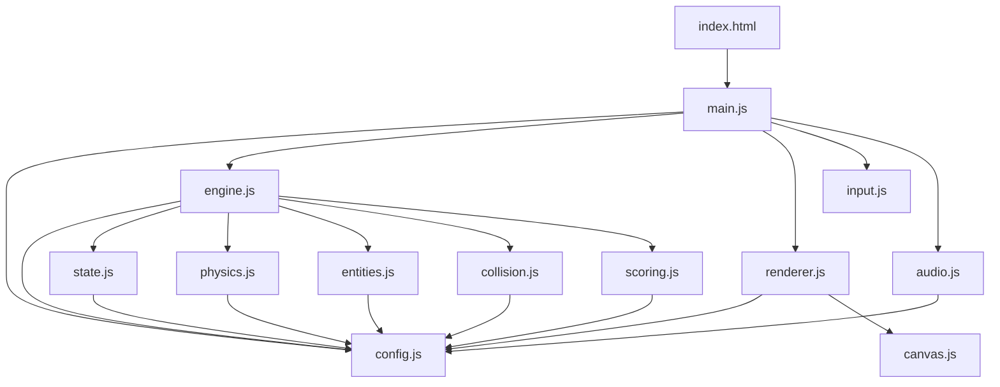
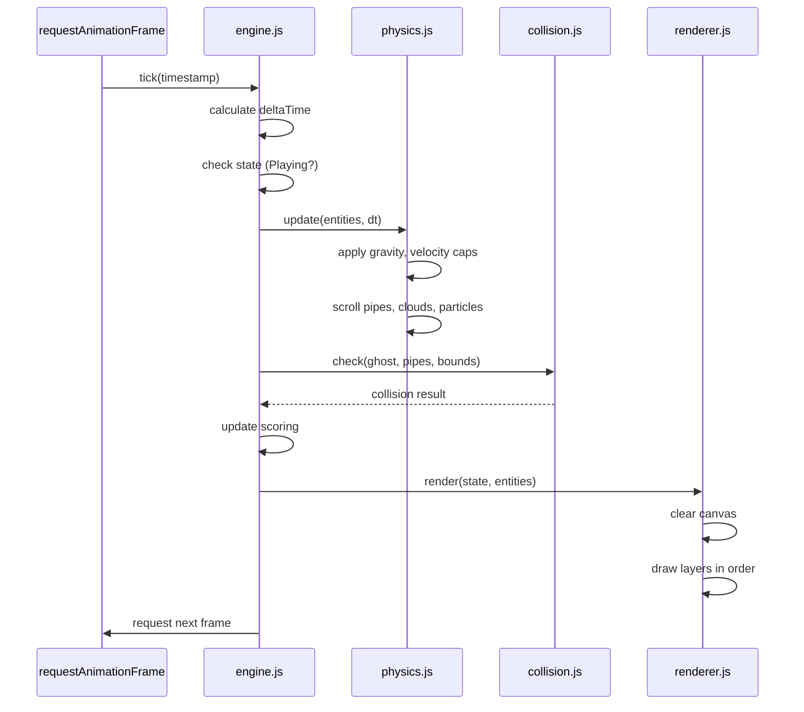
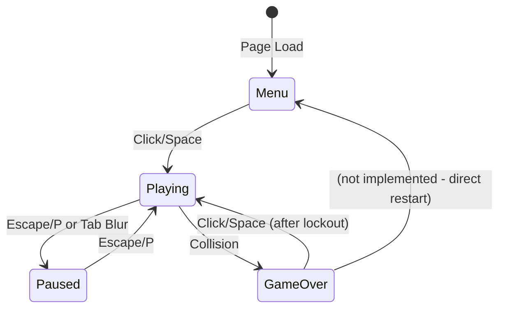
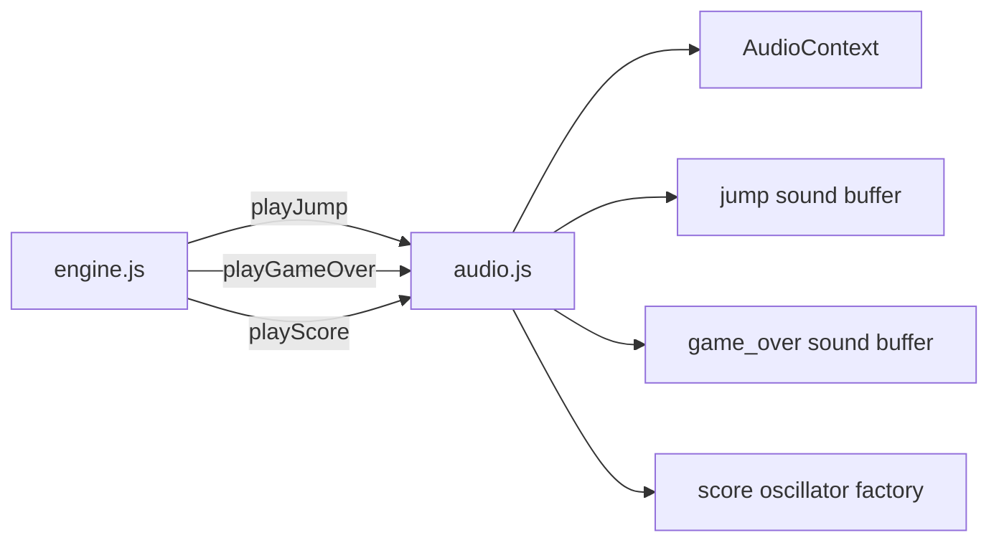

# Design Document: Flappy Kiro

## Overview

Flappy Kiro is a retro, hand-drawn style endless side-scrolling browser game built with HTML5 Canvas and vanilla JavaScript ES modules. The player controls a ghost character through gaps between pipes, with progressive difficulty, particle effects, screen shake, and persistent high scores.

The architecture centers on a **centralized configuration module** (`config.js`) that holds all tunable game constants—physics values, speeds, sizes, colors, and timings. This allows rapid iteration on game feel without modifying game logic. The game uses a fixed-timestep game loop with a finite state machine governing transitions between Menu, Playing, Paused, and Game Over states.

**Key Design Decisions:**
- All magic numbers live in `config.js`, grouped by category
- ES module imports for clean dependency management (no bundler needed)
- Fixed internal resolution (900×600) with display scaling for responsive sizing
- Delta-time interpolation for frame-rate-independent physics
- Entity-component pattern: each game object (Ghost, Pipe, Cloud, Particle) is a plain data object updated by system functions
- Circular hitbox for the Ghost with circle-vs-rectangle collision testing for fairness
- Object pooling for Pipes and Particles to eliminate per-frame garbage collection
- Render batching to minimize Canvas 2D context state changes per frame

## Architecture

### High-Level Module Structure



### Game Loop (Fixed Timestep)



### State Machine



## Components and Interfaces

### Module Responsibilities

| Module | Responsibility |
|--------|---------------|
| `config.js` | All game constants, grouped by category. Single source of truth for tuning. |
| `main.js` | Entry point. Initializes canvas, loads assets, starts engine. |
| `engine.js` | Game loop orchestration. Calls update/render per frame. Manages state transitions. |
| `state.js` | Game state machine. Exposes current state and transition functions. |
| `physics.js` | Ghost gravity/velocity, pipe scrolling, cloud scrolling, particle lifecycle. |
| `entities.js` | Factory functions and object pools for Ghost, Pipe, Cloud, Particle, ScorePopup objects. |
| `collision.js` | Circle-vs-rectangle collision detection between ghost circular hitbox and pipe AABBs/bounds. |
| `scoring.js` | Score tracking, high score persistence (localStorage), score popup creation. |
| `renderer.js` | All Canvas 2D drawing. Layer ordering, hand-drawn effects, screen shake. |
| `canvas.js` | Canvas setup, responsive scaling, viewport fitting. |
| `input.js` | Keyboard and mouse/touch event binding. Dispatches actions to engine. |
| `audio.js` | Sound effect preloading, playback, Web Audio API oscillator for score sound. |

### Module Communication Pattern

Modules communicate through **function calls with shared state objects**. The engine maintains a central game state object that is passed to update and render functions. No event bus or pub/sub—direct imports keep things simple for a single-page game.

```javascript
// engine.js orchestrates the flow
import { updatePhysics } from './physics.js';
import { checkCollisions } from './collision.js';
import { render } from './renderer.js';
import { gameState } from './state.js';

function tick(timestamp) {
  const dt = calcDeltaTime(timestamp);
  if (gameState.current === 'playing') {
    updatePhysics(gameState.entities, dt);
    const collision = checkCollisions(gameState.entities.ghost, gameState.entities.pipes);
    if (collision) handleGameOver();
    updateScoring(gameState);
  }
  render(gameState);
  requestAnimationFrame(tick);
}
```

## Data Models

### Ghost

```javascript
{
  x: number,             // Fixed horizontal position (~300px, 1/3 of canvas)
  y: number,             // Current vertical position
  velocity: number,      // Current vertical velocity (positive = down)
  width: number,         // Sprite width (from config)
  height: number,        // Sprite height (from config)
  rotation: number,      // Current rotation angle in radians
  sprite: HTMLImageElement | null,  // Loaded sprite or null (fallback to circle)
  isInvincible: boolean, // True during invincibility frames
  invincibleTimer: number, // Remaining invincibility time (ms)
  flashVisible: boolean, // Toggle for invincibility flash effect
  bobOffset: number,     // Vertical offset for menu idle animation
  bobTimer: number,      // Timer for bob cycle
  // Circular hitbox (derived each frame from position)
  centerX: number,       // x + width/2 (sprite center X)
  centerY: number,       // y + height/2 (sprite center Y)
  radius: number         // width/2 - hitboxMargin (collision radius)
}
```

**Hitbox note:** `centerX`, `centerY`, and `radius` are recomputed each frame after position updates. The radius is constant (`width/2 - 4`) but stored on the object for convenience. Collision detection uses a circle-vs-rectangle intersection test against pipe AABBs.

### Pipe

```javascript
{
  x: number,             // Current horizontal position (left edge)
  topHeight: number,     // Height of the top pipe (from canvas top to gap start)
  bottomY: number,       // Y position where bottom pipe starts (gap end)
  width: number,         // Pipe body width (from config: 60px)
  capWidth: number,      // Cap width (from config: 68px)
  capHeight: number,     // Cap height (from config: 15px)
  gapCenter: number,     // Vertical center of the gap
  scored: boolean,       // Whether this pipe has been counted for score
  active: boolean        // Whether this pipe is currently in use (pool management)
}
```

### Cloud

```javascript
{
  x: number,             // Current horizontal position
  y: number,             // Vertical position
  width: number,         // Cloud width (randomized within range)
  height: number,        // Cloud height (randomized within range)
  speed: number,         // Individual scroll speed (slower than pipes)
  opacity: number,       // Transparency (0.4–0.8, correlates with speed)
  cornerRadius: number   // Rounded rectangle corner radius
}
```

### Particle

```javascript
{
  x: number,             // Current horizontal position
  y: number,             // Current vertical position
  radius: number,        // Circle radius (2–4px)
  opacity: number,       // Current opacity (starts at 0.6, fades to 0)
  lifetime: number,      // Total lifetime in ms (400)
  age: number,           // Current age in ms
  velocityX: number,     // Horizontal drift speed (leftward)
  velocityY: number,     // Slight vertical drift
  active: boolean        // Whether this particle is currently in use (pool management)
}
```

### ScorePopup

```javascript
{
  x: number,             // Starting horizontal position (ghost position)
  y: number,             // Starting vertical position (ghost position)
  opacity: number,       // Current opacity (fades from 1 to 0)
  lifetime: number,      // Total lifetime in ms (500)
  age: number,           // Current age in ms
  text: string           // Display text ("+1")
}
```

### GameState

```javascript
{
  current: 'menu' | 'playing' | 'paused' | 'gameOver',
  score: number,
  highScore: number,
  speedMultiplier: number,
  frameCount: number,         // For particle emission timing
  inputLockoutTimer: number,  // Game-over input lockout (500ms)
  screenShake: {
    active: boolean,
    timer: number,            // Remaining shake time (ms)
    offsetX: number,
    offsetY: number
  },
  scorePulse: {
    active: boolean,
    timer: number,            // Remaining pulse time (ms)
    scale: number             // Current scale factor
  },
  entities: {
    ghost: Ghost,
    pipePool: ObjectPool,     // Pool of Pipe objects (acquire/release)
    clouds: Cloud[],
    particlePool: ObjectPool, // Pool of Particle objects (acquire/release)
    scorePopups: ScorePopup[]
  }
}
```

**Note:** Active pipes and particles are accessed via `pipePool.getActive()` and `particlePool.getActive()` respectively. On game restart, `pipePool.releaseAll()` and `particlePool.releaseAll()` are called instead of clearing arrays.

### Config Module Structure (`config.js`)

```javascript
// config.js - All game constants centralized here
export const CONFIG = {
  canvas: {
    width: 900,
    height: 600,
    aspectRatio: 3 / 2,
    minDisplayWidth: 300,
    minDisplayHeight: 200,
  },

  ghost: {
    x: 300,                    // Fixed horizontal position (1/3 of 900)
    startY: 300,               // Starting vertical position (center)
    width: 40,                 // Sprite width
    height: 40,                // Sprite height
    hitboxMargin: 4,           // Pixels reduced from each side for fairness
    fallbackRadius: 18,        // Radius for fallback circle rendering
  },

  physics: {
    gravity: 0.6,              // Pixels per frame²
    flapImpulse: -10,          // Pixels per frame (upward)
    terminalVelocity: 12,      // Max downward velocity
    targetFPS: 60,
    frameTime: 1000 / 60,      // ~16.67ms
  },

  pipes: {
    width: 60,
    capWidth: 68,
    capHeight: 15,
    gapHeight: 150,
    spacing: 280,              // Horizontal distance between pipe pairs
    minTopHeight: 50,          // Minimum pipe visible at top
    minBottomHeight: 50,       // Minimum pipe visible at bottom
    baseSpeed: 3,              // Pixels per frame at 60fps
  },

  difficulty: {
    speedIncrementPerPoint: 0.02,
    maxSpeedMultiplier: 2.0,
    startingMultiplier: 1.0,
  },

  clouds: {
    count: { min: 3, max: 6 },
    width: { min: 80, max: 160 },
    height: { min: 30, max: 60 },
    opacity: { min: 0.4, max: 0.8 },
    speedFactor: { min: 0.3, max: 0.7 }, // Relative to pipe speed
  },

  particles: {
    emitInterval: 3,           // Emit every N frames
    radius: { min: 2, max: 4 },
    initialOpacity: 0.6,
    lifetime: 400,             // Milliseconds
    driftSpeed: -1.5,          // Leftward horizontal drift
  },

  scoreBar: {
    height: 40,
    backgroundColor: '#2d2d2d',
    textColor: '#ffffff',
    fontSize: 18,
    pulseScale: 1.3,
    pulseDuration: 200,        // Milliseconds
  },

  scorePopup: {
    lifetime: 500,             // Milliseconds
    floatSpeed: -2,            // Upward drift per frame
    fontSize: 24,
    color: '#ffffff',
  },

  screenShake: {
    duration: 300,             // Milliseconds
    maxDisplacement: 5,        // Pixels
  },

  invincibility: {
    duration: 300,             // Milliseconds
    flashInterval: 100,        // Toggle every N ms
    minOpacity: 0.3,
    maxOpacity: 1.0,
  },

  gameOver: {
    inputLockout: 500,         // Milliseconds before restart accepted
  },

  menu: {
    bobAmplitude: 5,           // Pixels of vertical oscillation
    bobPeriod: 2000,           // Milliseconds per full cycle
    titleFontSize: 48,
    promptFontSize: 20,
  },

  rotation: {
    maxUp: -30 * (Math.PI / 180),   // Radians (-30 degrees)
    maxDown: 90 * (Math.PI / 180),  // Radians (90 degrees)
  },

  colors: {
    background: '#87CEEB',
    pipeBody: '#228B22',
    pipeCap: '#165B16',
    pipeStroke: '#145214',
    cloudFill: '#ffffff',
    scoreBarBg: '#2d2d2d',
    scoreBarText: '#ffffff',
    ghostFallback: '#ffffff',
    pauseOverlay: 'rgba(0, 0, 0, 0.5)',
  },

  handDrawn: {
    strokeOffset: { min: 1, max: 3 }, // Random offset for hand-drawn edges
  },

  audio: {
    jumpFile: 'assets/jump.wav',
    gameOverFile: 'assets/game_over.wav',
    scoreTone: {
      startFrequency: 600,
      endFrequency: 900,
      duration: 100,           // Milliseconds
    },
  },

  storage: {
    highScoreKey: 'flappyKiroHighScore',
  },

  pools: {
    pipeSize: 20,              // Pre-allocated pipe objects
    particleSize: 50,          // Pre-allocated particle objects
  },

  performance: {
    targetFPS: 60,
    slowFrameThreshold: 20,    // Milliseconds (below 50 FPS)
    slowFrameAlertCount: 10,   // Consecutive slow frames before warning
  },
};
```

## Render Pipeline and Layer Ordering

Rendering occurs every frame regardless of game state. Layers are drawn back-to-front:

1. **Background** — Fill entire canvas with `CONFIG.colors.background`
2. **Clouds** — Semi-transparent rounded rectangles with parallax scrolling
3. **Pipes** — Green rectangles with darker cap pieces, hand-drawn stroke offsets
4. **Particles** — White semi-transparent circles trailing from ghost
5. **Ghost** — Sprite (or fallback circle), rotated, with invincibility flash
6. **Score Popups** — Floating "+1" text elements
7. **Score Bar** — Dark bar at bottom with score/high-score text
8. **Screen Shake** — Applied as a translate offset to the entire canvas context before drawing (steps 1–7), so everything shakes together
9. **UI Overlays** — Menu text, pause overlay, game-over screen (drawn on top of everything)

The screen shake offset is computed before rendering begins and applied via `ctx.translate(shakeX, shakeY)` with a `ctx.save()`/`ctx.restore()` wrap.

### Hand-Drawn Effect

Each rendered rectangle edge gets a small random offset (1–3px) applied to its stroke path. This is recalculated each frame for a subtle wobble effect. The fill remains stable; only the stroke path is offset.

## Audio System Design



### Approach

- Use the **Web Audio API** for precise timing and overlap control
- Preload both `.wav` files as `AudioBuffer` objects on page load
- For jump sound: create a new `AudioBufferSourceNode` each play, stop any previous instance first (restart behavior per Req 10.4)
- For game over: one-shot playback
- For score sound: create a short-lived `OscillatorNode` with frequency sweep (600→900Hz over 100ms)
- **Graceful degradation**: Wrap all audio operations in try/catch. If `AudioContext` creation fails or files fail to decode, set an `audioEnabled = false` flag and skip all playback calls silently
- **Autoplay policy**: Create `AudioContext` on first user interaction (click/keypress) to comply with browser autoplay restrictions

### API

```javascript
// audio.js exports
export function initAudio();              // Preload buffers
export function resumeAudioContext();     // Call on first user gesture
export function playJump();               // Play jump.wav (restart if playing)
export function playGameOver();           // Play game_over.wav
export function playScoreTone();          // Generate oscillator sweep
```

## Collision Detection

### Approach: Circle-vs-Rectangle Intersection

The Ghost uses a circular hitbox (centered at the sprite center, with a radius reduced by a fairness margin). Pipes remain axis-aligned bounding boxes. Collision is detected by finding the closest point on each pipe rectangle to the circle center and checking if the distance from that point to the center is less than the radius.

This approach provides more forgiving collisions at the corners of pipes (a circle clips corners less than a bounding box) while remaining computationally cheap.

### Ghost Circular Hitbox Calculation

```javascript
function getGhostHitbox(ghost) {
  const centerX = ghost.x + ghost.width / 2;
  const centerY = ghost.y + ghost.height / 2;
  const radius = ghost.width / 2 - CONFIG.ghost.hitboxMargin; // width/2 - 4
  return { centerX, centerY, radius };
}
```

### Pipe Hitbox Calculation

Each pipe pair produces two AABBs (unchanged—pipes are rectangles):
- **Top pipe**: `{ left: pipe.x - capExtension, top: 0, right: pipe.x + pipe.width + capExtension, bottom: pipe.topHeight + capHeight }`
  - Uses full cap width to include the cap overhang
- **Bottom pipe**: `{ left: pipe.x - capExtension, top: pipe.bottomY - capHeight, right: pipe.x + pipe.width + capExtension, bottom: canvasHeight - scoreBarHeight }`

Where `capExtension = (capWidth - width) / 2 = 4`.

### Circle-vs-Rectangle Intersection Algorithm

```javascript
function circleIntersectsRect(circle, rect) {
  // Find the closest point on the rectangle to the circle center
  const closestX = Math.max(rect.left, Math.min(circle.centerX, rect.right));
  const closestY = Math.max(rect.top, Math.min(circle.centerY, rect.bottom));

  // Calculate distance from circle center to closest point
  const dx = circle.centerX - closestX;
  const dy = circle.centerY - closestY;
  const distanceSquared = dx * dx + dy * dy;

  // Collision if distance < radius (compare squared to avoid sqrt)
  return distanceSquared < circle.radius * circle.radius;
}
```

### Boundary Checks (Circle-Based)

- **Floor (Score_Bar)**: `ghost.centerY + ghost.radius > CONFIG.canvas.height - CONFIG.scoreBar.height`
- **Ceiling**: `ghost.centerY - ghost.radius < 0`

### Collision Response

On collision detection:
1. Set `gameState.current = 'gameOver'`
2. Activate screen shake (`screenShake.active = true`, `screenShake.timer = CONFIG.screenShake.duration`)
3. Activate invincibility frames
4. Play game over sound
5. Start input lockout timer
6. Save high score if applicable

## Object Pooling

### Design

To avoid garbage collection pauses during gameplay, Pipes and Particles use pre-allocated object pools. Instead of creating and destroying objects, the engine acquires inactive objects from a pool, resets their properties, and returns them to the pool when they are no longer needed.

### Pool Implementation

```javascript
class ObjectPool {
  constructor(factoryFn, initialSize) {
    this.factory = factoryFn;
    this.pool = [];
    // Pre-allocate objects at initialization
    for (let i = 0; i < initialSize; i++) {
      const obj = this.factory();
      obj.active = false;
      this.pool.push(obj);
    }
  }

  acquire() {
    // Find first inactive object
    for (let i = 0; i < this.pool.length; i++) {
      if (!this.pool[i].active) {
        this.pool[i].active = true;
        return this.pool[i];
      }
    }
    // Pool exhausted — grow by one (should be rare with proper sizing)
    const obj = this.factory();
    obj.active = true;
    this.pool.push(obj);
    return obj;
  }

  release(obj) {
    obj.active = false;
  }

  releaseAll() {
    for (let i = 0; i < this.pool.length; i++) {
      this.pool[i].active = false;
    }
  }

  getActive() {
    return this.pool.filter(obj => obj.active);
  }
}
```

### Pool Usage

- **Pipe pool**: When a new Pipe_Pair is needed, acquire two pipe objects, reset their position/gap properties, and mark them active. When a pipe scrolls off-screen, release it back to the pool (set `active = false`).
- **Particle pool**: When a new particle is emitted, acquire a particle object, reset its position/opacity/age. When a particle's age exceeds its lifetime, release it back to the pool.
- **On game restart**: Call `releaseAll()` on both pools to deactivate all objects without deallocating.

### Pool Sizing

Pool sizes are configured in `config.js`. They should be large enough that pool exhaustion never occurs during normal gameplay:
- Pipe pool: `CONFIG.pools.pipeSize` (20 — enough for ~10 pipe pairs on screen, well beyond the max visible at once)
- Particle pool: `CONFIG.pools.particleSize` (50 — at 1 particle every 3 frames with 400ms lifetime at 60fps, max ~8 alive at once, but allows headroom)

## Performance Optimization

### Frame Rate Target

The game targets a consistent 60 FPS. The game loop uses `requestAnimationFrame` and delta-time normalization to handle minor frame variance, but the design goal is to keep per-frame work well under 16.67ms.

### Render Batching

To minimize Canvas 2D context state changes, similar draw operations are grouped together:

1. **Background batch**: Single fill rect call
2. **Cloud batch**: Set cloud fill style once, draw all clouds before changing state
3. **Pipe batch**: Set pipe fill/stroke styles once, draw all pipe bodies, then all pipe caps, then all strokes
4. **Particle batch**: Set particle composite operation and style once, draw all active particles in a single pass
5. **Ghost draw**: Single sprite/circle draw
6. **UI batch**: Score popups, score bar, overlays

This reduces context state changes from O(entities) to O(entity-types).

### Zero-Allocation Per-Frame Paths

The update and render loops avoid object allocation on the hot path:
- No `new` in the per-frame update or render functions
- Pipe/Particle creation goes through object pools (reusing existing objects)
- Temporary geometry values (hitbox calculations) use pre-allocated scratch objects or direct return of primitives
- Array filtering (`getActive()`) is the only allocation, and it can be replaced with an iteration pattern if profiling shows it's a bottleneck

### Performance Monitoring

```javascript
// In engine.js
let slowFrameCount = 0;
const SLOW_FRAME_THRESHOLD = 20; // ms (below 50 FPS)
const SLOW_FRAME_ALERT_COUNT = 10; // consecutive slow frames

function tick(timestamp) {
  const frameStart = performance.now();
  // ... update and render ...
  const frameTime = performance.now() - frameStart;

  if (frameTime > SLOW_FRAME_THRESHOLD) {
    slowFrameCount++;
    if (slowFrameCount > SLOW_FRAME_ALERT_COUNT) {
      console.warn(`Performance warning: ${slowFrameCount} consecutive frames above ${SLOW_FRAME_THRESHOLD}ms`);
      slowFrameCount = 0; // Reset after warning to avoid spam
    }
  } else {
    slowFrameCount = 0;
  }
}
```

## File Structure

```
flappy-kiro/
├── index.html           # Single HTML page, loads main.js as module
├── js/
│   ├── main.js          # Entry point: init canvas, load assets, start loop
│   ├── config.js        # All game constants (centralized)
│   ├── engine.js        # Game loop, state transitions, orchestration
│   ├── state.js         # State machine (menu/playing/paused/gameOver)
│   ├── physics.js       # Gravity, velocity, scrolling, delta-time
│   ├── entities.js      # Factory functions for game objects
│   ├── collision.js     # Circle-vs-rectangle collision detection
│   ├── scoring.js       # Score logic, localStorage persistence
│   ├── renderer.js      # All Canvas 2D drawing, layer ordering
│   ├── canvas.js        # Canvas setup, responsive scaling
│   ├── input.js         # Keyboard/mouse/touch event handling
│   └── audio.js         # Web Audio API, sound loading/playback
├── assets/
│   ├── ghosty.png       # Ghost sprite
│   ├── jump.wav         # Flap sound effect
│   └── game_over.wav    # Game over sound effect
└── img/
    └── example-ui.png   # Reference screenshot
```

### index.html Structure

```html
<!DOCTYPE html>
<html lang="en">
<head>
  <meta charset="UTF-8">
  <meta name="viewport" content="width=device-width, initial-scale=1.0">
  <title>Flappy Kiro</title>
  <style>
    * { margin: 0; padding: 0; box-sizing: border-box; }
    body { background: #1a1a2e; display: flex; justify-content: center; align-items: center; height: 100vh; overflow: hidden; }
    canvas { display: block; image-rendering: pixelated; }
  </style>
</head>
<body>
  <canvas id="gameCanvas"></canvas>
  <script type="module" src="js/main.js"></script>
</body>
</html>
```

## Correctness Properties

*A property is a characteristic or behavior that should hold true across all valid executions of a system—essentially, a formal statement about what the system should do. Properties serve as the bridge between human-readable specifications and machine-verifiable correctness guarantees.*

### Property 1: Canvas scaling maintains aspect ratio and fits viewport

*For any* viewport dimensions (width, height), the computed canvas display size SHALL maintain a 3:2 aspect ratio (width/height = 1.5 within floating-point tolerance) AND fit entirely within the viewport bounds, AND be at least the minimum display size (300×200) when the viewport is very small.

**Validates: Requirements 1.1, 9.1, 9.4**

### Property 2: Gravity increases velocity, capped at terminal velocity

*For any* ghost with a current vertical velocity, after one physics frame the velocity SHALL equal min(currentVelocity + gravity, terminalVelocity). The resulting velocity SHALL never exceed terminalVelocity (12 px/frame).

**Validates: Requirements 2.1, 2.2**

### Property 3: Flap always sets velocity to flapImpulse

*For any* ghost with any current vertical velocity (positive, negative, or zero), applying a flap SHALL set the vertical velocity to exactly flapImpulse (-10 px/frame), regardless of the prior velocity value.

**Validates: Requirements 2.3**

### Property 4: Position updates are proportional to delta time

*For any* ghost with velocity v and any positive delta time dt, the position change SHALL equal v × (dt / frameTime). When dt equals frameTime, the position change equals exactly v.

**Validates: Requirements 2.4**

### Property 5: Ghost horizontal position is invariant

*For any* game state during Playing, after applying physics updates (gravity, flap, position integration), the ghost's x coordinate SHALL remain unchanged from its initial value.

**Validates: Requirements 2.5, 2.7**

### Property 6: Rotation linearly interpolates between bounds based on velocity

*For any* ghost vertical velocity in the range [flapImpulse, terminalVelocity], the computed rotation angle SHALL be linearly interpolated between maxUp (-30°) and maxDown (90°). The rotation SHALL be clamped to these bounds for velocities outside the range.

**Validates: Requirements 2.6**

### Property 7: Pipe generation produces valid gap positioning

*For any* generated pipe pair, the gap center SHALL be positioned such that at least 50px of pipe is visible at the top AND at least 50px of pipe is visible above the score bar at the bottom. The gap height SHALL always be exactly 150px.

**Validates: Requirements 3.2, 3.3**

### Property 8: Pipe spacing is fixed at 280 pixels

*For any* pair of consecutively generated pipes, the horizontal distance between them SHALL be exactly 280 pixels, regardless of the current speed multiplier.

**Validates: Requirements 3.1, 12.4**

### Property 9: Pipe scroll displacement equals baseSpeed × multiplier × dt

*For any* pipe at position x with any speed multiplier in [1.0, 2.0] and any positive delta time dt, the new position SHALL equal x - (baseSpeed × speedMultiplier × dt / frameTime).

**Validates: Requirements 3.4**

### Property 10: Off-screen pipes are removed

*For any* collection of pipes, after the cleanup step, all pipes whose right edge (x + width) is less than 0 SHALL be removed, and all pipes with right edge >= 0 SHALL be retained.

**Validates: Requirements 3.5**

### Property 11: Speed multiplier formula

*For any* non-negative integer score, the speed multiplier SHALL equal min(1.0 + score × 0.02, 2.0). The multiplier SHALL never exceed 2.0 regardless of score.

**Validates: Requirements 3.6, 12.1, 12.2**

### Property 12: Ghost hitbox is a circle derived from sprite dimensions

*For any* ghost at position (x, y) with dimensions (width, height), the hitbox SHALL be a circle with centerX = x + width/2, centerY = y + height/2, and radius = width/2 - hitboxMargin (4px).

**Validates: Requirements 4.1**

### Property 13: Circle-vs-rectangle collision detection is correct

*For any* circle (centerX, centerY, radius) and axis-aligned rectangle (left, top, right, bottom), the collision function SHALL return true if and only if the distance from the circle center to the closest point on the rectangle is less than the circle radius. The closest point is computed as (clamp(centerX, left, right), clamp(centerY, top, bottom)).

**Validates: Requirements 4.2**

### Property 14: Boundary collisions detected at ceiling and floor using circle

*For any* ghost circular hitbox, a floor collision SHALL be detected if and only if centerY + radius > canvasHeight - scoreBarHeight, AND a ceiling collision SHALL be detected if and only if centerY - radius < 0.

**Validates: Requirements 4.4, 4.5**

### Property 15: Screen shake displacement within bounds

*For any* time t in [0, shakeDuration], the screen shake offset in both x and y axes SHALL have absolute value ≤ maxDisplacement (5px), and SHALL decay toward zero as t approaches shakeDuration.

**Validates: Requirements 4.7**

### Property 16: Score increments exactly once per pipe pass

*For any* pipe that transitions from having its right edge > ghost.x to right edge ≤ ghost.x, the score SHALL increment by exactly 1, and subsequent frames with the same pipe SHALL not increment the score again (pipe.scored prevents double-counting).

**Validates: Requirements 5.1**

### Property 17: High score is always max of previous high and current score

*For any* current score and previous high score values, after the high score update, highScore SHALL equal max(previousHigh, currentScore).

**Validates: Requirements 5.4**

### Property 18: Game reset restores all state to initial values

*For any* game state (regardless of current score, multiplier, pipe positions, particles, or ghost state), after applying the reset function, score SHALL be 0, speedMultiplier SHALL be 1.0, pipes SHALL be empty, particles SHALL be empty, ghost.y SHALL be startY, ghost.velocity SHALL be 0, and state SHALL be 'playing'. The highScore SHALL be preserved unchanged.

**Validates: Requirements 7.4, 12.3**

### Property 19: Cloud generation produces valid properties

*For any* set of generated clouds, the count SHALL be between 3 and 6 inclusive, each cloud's opacity SHALL be in [0.4, 0.8], and clouds with higher opacity SHALL have higher scroll speed (positive correlation between opacity and speed).

**Validates: Requirements 8.3**

### Property 20: Hand-drawn stroke offsets are within bounds

*For any* invocation of the hand-drawn stroke offset generator, the returned value SHALL be in the range [1, 3] inclusive.

**Validates: Requirements 8.5**

### Property 21: Particle spawns at ghost center-rear position

*For any* ghost at position (x, y) with dimensions (width, height), a newly emitted particle's initial position SHALL have x equal to ghost.x (rear edge) and y equal to ghost.y + height/2 (vertical center).

**Validates: Requirements 8.9**

### Property 22: Pause freezes all entity state

*For any* game state in Paused, after calling the update function, all entity positions (ghost.y, ghost.velocity, all pipe.x values, all cloud.x values, all particle positions) and the score SHALL remain unchanged from their values before the update call.

**Validates: Requirements 11.2**

### Property 23: Object pool acquire/release round-trip preserves pool size

*For any* object pool of initial size N, after acquiring K objects (K ≤ N) and then releasing all K objects, the number of available (inactive) objects in the pool SHALL equal N. No objects are created or destroyed during normal acquire/release cycles.

**Validates: Requirements 13.2, 13.3, 13.5**

### Property 24: Circle-vs-rectangle collision agrees with geometric truth

*For any* circle center strictly inside a rectangle, the collision function SHALL return true. For any circle whose center is farther from all rectangle edges than its radius (distance from center to closest point > radius), the collision function SHALL return false.

**Validates: Requirements 4.2**

## Error Handling

### Asset Loading Failures

| Failure | Recovery |
|---------|----------|
| `ghosty.png` fails to load | Render white circle (radius from config) as fallback |
| `jump.wav` fails to decode | Set `audioEnabled = false`, skip all audio playback |
| `game_over.wav` fails to decode | Same as above |
| AudioContext creation blocked | Defer creation to first user gesture; if still fails, disable audio |

### localStorage Failures

| Failure | Recovery |
|---------|----------|
| localStorage unavailable (private browsing) | Default highScore to 0, skip persistence |
| Stored value is not a valid non-negative integer | Default highScore to 0 |
| Write fails (quota exceeded) | Catch error silently, continue gameplay |

### Runtime Errors

- All audio operations wrapped in try/catch to prevent game interruption
- `requestAnimationFrame` loop should never throw—wrap tick body in try/catch with console.error logging
- Division by zero protection in delta-time calculation (clamp dt to minimum 1ms)

## Testing Strategy

### Unit Tests (Example-Based)

Focus on specific scenarios and integration points:

- State machine transitions (Menu→Playing, Playing→Paused, etc.)
- Menu display elements present in correct positions
- Game over screen shows "New Best!" when appropriate
- Input lockout timing (500ms before restart accepted)
- Audio method calls triggered at correct game events
- Render layer ordering verification
- localStorage read/write with mock storage
- Object pool exhaustion behavior (pool grows when all objects are active)
- Pool releaseAll resets all objects on game restart

### Property-Based Tests

**Library**: [fast-check](https://github.com/dubzzz/fast-check) (JavaScript PBT library)

**Configuration**: Minimum 100 iterations per property test.

Each property test references its design document property with tag format:
**Feature: flappy-kiro, Property {N}: {title}**

Property tests cover:
- Physics calculations (gravity, velocity capping, flap, delta-time, rotation)
- Canvas scaling computation
- Pipe generation constraints (gap bounds, spacing, dimensions)
- Collision detection (circle-vs-rectangle intersection, boundary checks)
- Scoring logic (increment, high score max)
- Speed multiplier formula
- Game reset completeness
- Cloud/particle generation constraints
- Screen shake bounds
- Hand-drawn offset bounds
- Object pool acquire/release conservation

### Integration Tests

- Full game loop tick with mock canvas context
- Pause/resume preserves complete state
- Game over → restart cycle
- Audio context initialization on user gesture
- Extended play session: verify no memory growth (pool sizes stable)

### Edge Case Tests

- Viewport smaller than minimum (300×200)
- localStorage throwing on read/write
- Audio decode failure
- Sprite load failure (fallback circle)
- Zero delta-time frame
- Very large delta-time (tab was backgrounded)
- Circle center exactly on rectangle edge (collision boundary)
- Circle center inside rectangle (always collides)
- Pool fully exhausted (all objects active, new acquire triggers growth)


## Correctness Properties

*A property is a characteristic or behavior that should hold true across all valid executions of a system — essentially, a formal statement about what the system should do. Properties serve as the bridge between human-readable specifications and machine-verifiable correctness guarantees.*

### Property 1: Canvas scaling maintains aspect ratio and fits viewport

*For any* viewport dimensions (width, height), the computed canvas display size SHALL maintain a 3:2 aspect ratio, fit entirely within the viewport, and never be smaller than the minimum display size (300×200) unless the viewport itself is smaller.

**Validates: Requirements 1.1, 9.1, 9.4**

### Property 2: Ghost physics — gravity and terminal velocity

*For any* ghost vertical velocity and normalized delta time, after a physics update the new velocity SHALL equal `min(velocity + GRAVITY * deltaTime, TERMINAL_VELOCITY)`. The velocity must never exceed TERMINAL_VELOCITY regardless of how many frames accumulate.

**Validates: Requirements 2.1, 2.2**

### Property 3: Flap always resets velocity to impulse

*For any* current ghost vertical velocity (positive, negative, or zero), applying a flap SHALL set the velocity to exactly FLAP_IMPULSE (-10), discarding the previous velocity entirely.

**Validates: Requirements 2.3**

### Property 4: Delta-time position integration

*For any* ghost position `y`, velocity `v`, and normalized delta time `dt`, the updated position SHALL equal `y + v * dt`. This ensures frame-rate-independent movement.

**Validates: Requirements 2.4**

### Property 5: Ghost horizontal position invariant

*For any* sequence of game updates (flaps, gravity, pipe scrolling) while the Game_State is Playing, the ghost's x-coordinate SHALL remain constant at `CONFIG.ghost.x`.

**Validates: Requirements 2.5, 2.7**

### Property 6: Ghost rotation clamped and interpolated

*For any* ghost vertical velocity in the range [FLAP_IMPULSE, TERMINAL_VELOCITY], the computed rotation angle SHALL be linearly interpolated between MAX_UP_TILT (-30°) and MAX_DOWN_TILT (90°), and for velocities outside this range the angle SHALL be clamped to the nearest bound.

**Validates: Requirements 2.6**

### Property 7: Pipe generation constraints

*For any* generated Pipe_Pair, the gap height SHALL be exactly `CONFIG.pipes.gapHeight` (150px), and the gap center SHALL be positioned such that at least `CONFIG.pipes.minTopHeight` (50px) of pipe is visible above the gap and at least `CONFIG.pipes.minBottomHeight` (50px) of pipe is visible below the gap (above the Score_Bar).

**Validates: Requirements 3.2, 3.3**

### Property 8: Speed multiplier formula

*For any* non-negative integer score value, the speed multiplier SHALL equal `min(1.0 + score * CONFIG.difficulty.speedIncrementPerPoint, CONFIG.difficulty.maxSpeedMultiplier)`, i.e., `min(1.0 + score * 0.02, 2.0)`.

**Validates: Requirements 3.6, 12.1, 12.2**

### Property 9: Circle-vs-rectangle collision detection correctness

*For any* circle (centerX, centerY, radius) and axis-aligned rectangle (left, top, right, bottom), the collision function SHALL return true if and only if the squared distance from the circle center to the closest point on the rectangle (clamped coordinates) is less than radius². This correctly handles center-inside-rect, edge contact, and corner contact cases.

**Validates: Requirements 4.2**

### Property 10: Boundary collision detection (circular hitbox)

*For any* ghost circular hitbox (centerY, radius), a floor collision SHALL be detected if and only if `centerY + radius > CONFIG.canvas.height - CONFIG.scoreBar.height`, and a ceiling collision SHALL be detected if and only if `centerY - radius < 0`.

**Validates: Requirements 4.4, 4.5**

### Property 11: Score increments exactly once per pipe

*For any* pipe that crosses the ghost's x-position threshold, the score SHALL increment by exactly 1, and subsequent frames with the same pipe past the threshold SHALL not increment the score again (idempotent marking via the `scored` flag).

**Validates: Requirements 5.1**

### Property 12: High score is max of current and stored

*For any* pair of (currentScore, storedHighScore), after a game-over evaluation the persisted high score SHALL equal `max(currentScore, storedHighScore)`.

**Validates: Requirements 5.4**

### Property 13: Pipe spacing invariant

*For any* speed multiplier value (between 1.0 and 2.0), the horizontal pixel distance between consecutively generated Pipe_Pairs SHALL remain exactly `CONFIG.pipes.spacing` (280px). Speed changes affect scroll velocity, not spatial arrangement.

**Validates: Requirements 12.4**

### Property 14: Object pool conservation

*For any* sequence of acquire and release operations on an object pool of initial size N, the total number of objects in the pool (active + inactive) SHALL always be ≥ N. After releasing all acquired objects, the count of inactive objects SHALL be ≥ N.

**Validates: Requirements 13.2, 13.3, 13.5**

## Error Handling

### Asset Loading Failures

| Failure | Recovery |
|---------|----------|
| `ghosty.png` fails to load | Render a white circle (radius `CONFIG.ghost.fallbackRadius`) as fallback sprite. Game continues normally. |
| `jump.wav` fails to decode | Set jump buffer to null. `playJump()` becomes a no-op. No gameplay impact. |
| `game_over.wav` fails to decode | Set game-over buffer to null. `playGameOver()` becomes a no-op. No gameplay impact. |

### Audio System Failures

| Failure | Recovery |
|---------|----------|
| `AudioContext` creation fails (browser restriction) | Set an `audioEnabled = false` flag. All play methods return immediately. |
| Autoplay policy blocks playback | Attempt to resume `AudioContext` on first user interaction (click/keydown). If still blocked, fall back to `audioEnabled = false`. |
| Oscillator creation fails for score tone | `playScoreTone()` catches error and returns silently. |

### localStorage Failures

| Failure | Recovery |
|---------|----------|
| `localStorage.getItem` throws (private browsing, disabled) | Return high score of 0. |
| `localStorage.getItem` returns non-numeric or negative value | Return high score of 0. |
| `localStorage.setItem` throws (quota exceeded, disabled) | Catch error silently. High score preserved in memory for current session only. |

### Canvas / Rendering Failures

| Failure | Recovery |
|---------|----------|
| `getContext('2d')` returns null | Display a static error message in the HTML page. Game does not start. |
| Viewport is extremely small (< 300×200) | Enforce minimum display size of 300×200px. Game remains playable. |

### Frame Rate Anomalies

| Situation | Behavior |
|-----------|----------|
| Very large delta time (tab was backgrounded then returned) | Clamp deltaTime to a maximum of 3× frame duration (~50ms). Prevents physics explosion. |
| `requestAnimationFrame` not available | Fall back to `setTimeout` at 60fps. Unlikely in modern browsers but graceful. |

### Input Edge Cases

| Situation | Behavior |
|-----------|----------|
| Rapid repeated inputs (key spam) | Process at most one flap per frame. Extra inputs discarded. |
| Input during Game_Over lockout (first 500ms) | Inputs silently ignored until lockout expires. |
| Space/Click while Paused | Ignored — only Escape/P resumes. Prevents accidental flap on resume. |

## Testing Strategy

### Unit Tests (Example-Based)

Unit tests verify specific behaviors with concrete inputs:

- **State transitions**: Menu→Playing, Playing→Paused, Paused→Playing, Playing→GameOver, GameOver→Playing
- **Game-over reset**: Score=0, multiplier=1.0, pipes cleared (all released to pool), ghost repositioned
- **Input lockout**: Inputs ignored during 500ms game-over lockout
- **Pause behavior**: All positions frozen, overlay triggered
- **Audio triggers**: Correct sounds fire on flap, score, game-over
- **localStorage round-trip**: Save high score, reload, verify restored
- **Fallback rendering**: Image load failure triggers circle fallback
- **Layer ordering**: Draw calls occur in correct z-order
- **Cloud repositioning**: Clouds reset to right edge when scrolling off left
- **Particle emission rate**: One particle every 3 frames while playing
- **Object pool exhaustion**: Acquiring more objects than pool size triggers pool growth
- **Object pool release**: Releasing an object makes it available for the next acquire
- **Pool releaseAll on restart**: All pipe and particle objects deactivated on game restart

### Property-Based Tests (Universal Properties)

Property tests use [fast-check](https://github.com/dubzzz/fast-check) to verify universal invariants across randomly generated inputs. Each property test runs a minimum of **100 iterations**.

Each test is tagged with a comment referencing its design property:
```javascript
// Feature: flappy-kiro, Property 1: Canvas scaling maintains aspect ratio and fits viewport
```

**Properties to implement:**

| # | Property | Generator Strategy |
|---|----------|-------------------|
| 1 | Canvas scaling | Random viewport widths [100–4000] × heights [100–3000] |
| 2 | Ghost physics | Random velocities [-20, 20], delta times [0.5, 3.0] |
| 3 | Flap resets velocity | Random velocities [-100, 100] |
| 4 | Position integration | Random (y, velocity, dt) triples |
| 5 | Ghost x invariant | Random sequences of flaps and frame counts |
| 6 | Rotation interpolation | Random velocities [-15, 15] (beyond bounds too) |
| 7 | Pipe constraints | Random gap centers within canvas, verify margins |
| 8 | Speed multiplier | Random scores [0, 200] |
| 9 | Circle-vs-rect collision | Random circles and rectangles with known overlap/non-overlap (center inside, edge contact, corner, miss) |
| 10 | Boundary collision | Random ghost centerY and radius values [-50, 650] |
| 11 | Score idempotence | Random pipe x positions crossing ghost threshold, multiple evaluations |
| 12 | High score max | Random (current, stored) score pairs [0, 10000] |
| 13 | Pipe spacing | Random speed multipliers [1.0, 2.0], verify generation spacing |
| 14 | Object pool conservation | Random sequences of acquire/release calls, verify pool invariants |

### Integration Tests

- **Full game cycle**: Start → play → score → die → restart → verify clean state
- **Responsive resize**: Resize viewport, verify canvas re-scales without physics disruption
- **Audio graceful degradation**: Block AudioContext, verify game plays silently
- **localStorage unavailable**: Mock storage failure, verify game runs with high score = 0
- **Extended session stability**: Run game loop for 1000+ frames, verify pool sizes remain stable (no unbounded growth)

### Test Configuration

```javascript
import fc from 'fast-check';

// Minimum 100 iterations per property
const testConfig = { numRuns: 100 };

// Example property test structure
// Feature: flappy-kiro, Property 9: Circle-vs-rectangle collision detection correctness
fc.assert(
  fc.property(
    fc.record({
      centerX: fc.float({ min: -100, max: 1000 }),
      centerY: fc.float({ min: -100, max: 700 }),
      radius: fc.float({ min: 1, max: 50 }),
    }),
    fc.record({
      left: fc.float({ min: 0, max: 900 }),
      top: fc.float({ min: 0, max: 600 }),
      width: fc.float({ min: 10, max: 200 }),
      height: fc.float({ min: 10, max: 600 }),
    }).map(r => ({ left: r.left, top: r.top, right: r.left + r.width, bottom: r.top + r.height })),
    (circle, rect) => {
      const closestX = Math.max(rect.left, Math.min(circle.centerX, rect.right));
      const closestY = Math.max(rect.top, Math.min(circle.centerY, rect.bottom));
      const dx = circle.centerX - closestX;
      const dy = circle.centerY - closestY;
      const expected = (dx * dx + dy * dy) < (circle.radius * circle.radius);
      return circleIntersectsRect(circle, rect) === expected;
    }
  ),
  testConfig
);
```

### Testing Boundaries

| Concern | Test Type |
|---------|-----------|
| Physics math (gravity, velocity, position) | Property-based |
| Collision detection (circle-vs-rect, boundaries) | Property-based |
| Canvas scaling/layout math | Property-based |
| Scoring formula (multiplier, high score) | Property-based |
| Pipe generation constraints | Property-based |
| Object pool invariants (acquire/release) | Property-based |
| State machine transitions | Unit (example-based) |
| Audio playback | Unit (mocked) |
| localStorage persistence | Unit (mocked) |
| Pool exhaustion and growth | Unit (example-based) |
| Render batching correctness | Unit (mocked canvas context) |
| Visual rendering correctness | Manual / snapshot |
| End-to-end game flow | Integration |
| Memory stability (no GC pauses) | Integration (extended session) |
